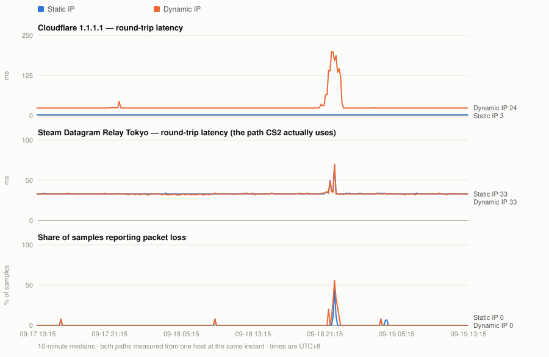
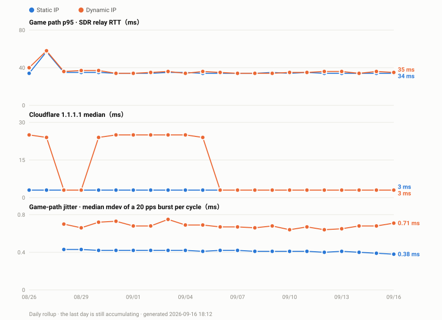

# CHT Static vs. Dynamic IP Ping Comparison for CS2

**English** · [繁體中文](README.md)

## TL;DR — the rest of this was written by Claude. In one line: get the static plan, it makes a real difference. (Your line may differ.)

A live, concurrent A/B of two ISP account types on the same line, measured from one
Raspberry Pi — including a way to measure the **actual UDP path a Source 2 game (CS2, in this case) uses**,
not just ICMP to something nearby.

Your median game ping will not drop — on the path the game actually takes, the two accounts
are identical. What changes is how steady it is: one dynamic burst in six contains a spike
past 60 ms, against one in 868 on the static account. And everything behind Cloudflare is a
different story entirely — 3 ms versus 24 ms at the median, with the dynamic path past
200 ms and losing packets at peak hours.

The data below is regenerated hourly from a probe that is still running.

<picture>
  <source media="(prefers-color-scheme: dark)" srcset="data/chart-dark.en.svg">
  
</picture>

Full numbers, always current: **[data/stats.en.md](data/stats.en.md)** · raw samples:
[data/paired-scrubbed.csv](data/paired-scrubbed.csv)

### Day to day

The chart above is a rolling 48-hour window, so a quiet day looks identical to the one
before it. This one is a **daily rollup** -- one point per day, growing for as long as the
probe keeps running:

<picture>
  <source media="(prefers-color-scheme: dark)" srcset="data/history-dark.en.svg">
  
</picture>

Per-day numbers: **[data/history.csv](data/history.csv)** -- one row per day, so the commit
diff is readable on its own. The last day is still accumulating and its values move.

---

## Why this exists

CS2 was spiking to 200 ms on an otherwise idle connection. The obvious suspects —
server picker, DNS, Wi-Fi — were all wrong. Traceroute pointed at one leg, between the
ISP (HiNet, AS3462) and Cloudflare (AS13335), where the hops looked wrong in a way the
rest of the path did not. The theory at the time was that traffic was detouring
internationally instead of peering locally.

That theory did not survive being measured. Both accounts reach Cloudflare's Taipei
colo, and the dynamic one is at 3 ms a quarter of the time — see
[Same BRAS, different route](#same-bras-different-route) below. The fault was real; the
first explanation reached for was not. Which is the whole argument for measuring instead
of reasoning from a traceroute.

The ISP offers a free switch from a dynamic-IP account to a static-IP one. The obvious
question — *does that actually change the route?* — turns out to be surprisingly hard to
answer honestly, and most of the advice online is people comparing a speed test today
against their memory of last week.

## What makes this measurement different

**Two problems with the naive A/B, and how each is fixed.**

### 1. Sequential comparison is worthless

Switch the account type, re-run the test, compare. This measures *when you tested*, not
*what you changed* — transient ISP faults clear on their own and get credited to
whatever you did last. An earlier version of this experiment produced a confident
conclusion this way. It was wrong, and the next day's data contradicted it.

The fix: a single host holds **both account types up at once**. The primary path is the
router's normal connection; the second is a PPPoE session dialled by the Pi itself with
`nodefaultroute`, kept off the default route and reachable only through a policy-routing
rule. Every loop iteration measures both **concurrently**, so whatever transient hits the
line hits both paths at once and cancels out of the comparison.

> **Correction, and a warning if you copy this.** The first version of `probe.sh` measured
> the two paths one after the other — 8.6 s and 10.4 s respectively — while stamping both
> rows with the loop-start time. The CSV *looked* simultaneous and was about 9 s apart.
> Samples before `2026-08-27 21:02` carry that offset. It is far too small to explain the
> Cloudflare result (a 20× difference sustained for hours) but it was an overstatement,
> and a shared timestamp column is a very easy way to fool yourself.

```sh
# /etc/ppp/peers/<name>
nodefaultroute          # the measurement session must never become the system default

# /etc/ppp/ip-up.d/50measure   ($1=iface $4=local IP $6=ipparam)
[ "$6" = "measure" ] || exit 0
ip route replace default dev "$1" table 200      # <- without this the rule does nothing
ip rule del priority 200 2>/dev/null
ip rule add from "$4" lookup 200 priority 200
```

Both halves are needed: the `ip rule` sends traffic *sourced from* the second session to
table 200, and the `ip route` is what gives table 200 somewhere to send it. With only the
rule, lookups fall through to the main table and you silently measure the same path twice —
which is exactly the failure that made the first attempt at this experiment worthless.

The Pi is not a router and does not carry household traffic. It only holds a second
session so the two paths can be compared fairly.

### 2. ICMP to 1.1.1.1 is not the path your game uses

Games on Valve's Steam Datagram Relay send **UDP to a relay**, not ICMP to a DNS
resolver. Those can take different physical links — ECMP hashes on the 5-tuple, so even
two UDP flows can diverge. Pinging Cloudflare tells you about the Cloudflare path and
nothing more.

**The useful trick:** an SDR relay replies to a junk UDP datagram on its game port.
Send 32 random bytes to a relay on `27015–27060` and it answers:

```
Invalid/unknown MsgID 0
```

That is a full round trip on the exact transport the game uses, from a plain socket, with
no game running and no client library. [`scripts/sdrping.py`](scripts/sdrping.py) does
this and prints `avg_rtt,loss`.

**Important limitation: RTT data is reliable, but packet loss is not a usable metric.** SDR relays silently drop a portion of invalid packets — whether the send interval is set to 0.12 s, 0.35 s, or 0.8 s, 16–33% of packets receive no response, while RTT consistently stays solid at 33.2–33.5 ms.

Initially, because the unresponded ratio appeared similar across all three intervals, it was misinterpreted as relays simply not guaranteeing responses to garbage packets rather than rate limiting. However, this assumption has been disproven by new test data — it is indeed rate limiting.

Rate scan results from 2026-08-28 (same probe, same relay `45.121.184.27:27023`):

| Send Rate | Duration | Sent | Responses Received |
|---|---|---|---|
| 1 pps | 12 s | 12 | 9 |
| 2 pps | 24 s | 24 | 9 |
| 5 pps | 60 s | 60 | 13 |
| 10 pps | 120 s | 120 | 12 |
| 20 pps | 240 s | 240 | 12 |

Key observation: **No matter how fast or how long packets are sent, the number of responses received is always capped between 9 and 13.** This is a classic token bucket mechanism: there is a small initial burst allowance (around 10 packets), after which the refill rate is extremely slow (roughly 0.05–0.1 per second).

This also explains why the original 0.12 / 0.35 / 0.8 s intervals showed "similar ratios" — those tests were short bursts sending 8 packets over a 45-second cycle, which fell entirely within the bucket capacity, masking any rate-limiting effects.

**Therefore, this tool must only be used to measure latency (RTT), and should never be used as an indicator of packet loss.**

Relay addresses come from Valve's own endpoint:

```
https://api.steampowered.com/ISteamApps/GetSDRConfig/v1/?appid=730
```

## What the data says

See [data/stats.en.md](data/stats.en.md) for live figures. The shape of the result:

| | Static IP | Dynamic IP |
|---|---|---|
| **Game path** (Tokyo SDR relay, UDP) | median ~34 ms | median ~34 ms — **paired delta ≈ 0 ms** |
| Game path p95 | flat, ≈ the median | wanders 38–52 ms |
| **Cloudflare 1.1.1.1** | 3 ms, unwavering | 24 ms baseline, **200 ms+ under evening load, with packet loss** |

So:

- **The static IP does not lower game ping.** The median difference on the actual game
  transport is zero. Anyone claiming a static IP "gives you better ping" is not measuring
  the game path.
- **It does remove jitter.** The static path's p95 equals its median hour after hour; the
  dynamic path's does not. For a twitch shooter that is worth more than a few ms of
  average.
- **The Cloudflare fault only exists on the dynamic path.** The two account pools are not
  handled identically — but it is not a detour. Both reach Cloudflare Taipei, and the
  dynamic path is at 3 ms a quarter of the time; the route quality to that one destination
  is simply unstable on one pool and not the other.

### The jitter a 45-second probe cannot see

The main probe samples every 45 seconds. What a player feels happens between two samples, so
a median or a p95 cannot answer "does it bounce".

So every cycle now also fires a short high-rate burst: 50 ICMP echoes per path at 20 pps,
2.5 seconds, recorded as two extra columns — `jit_mdev` (the mdev of that burst, i.e. the
jitter) and `jit_max` (the worst RTT inside it).

Why ICMP and not the UDP method used for the game path: the relay rate-limits its replies
with a token bucket, and the reply count caps at 9–13 no matter how fast you send. **The
price is that ICMP is not the game's UDP 5-tuple and may take a different ECMP bucket** —
this toolkit cannot have both properties, so that is said up front rather than buried.

As of the morning of 2026-08-28 this is **868 paired bursts** (about 9.5 hours), and still
growing.

The jitter itself, `jit_mdev` (ms):

| | median | p75 | p95 | p99 | max |
|---|---|---|---|---|---|
| Static IP | 0.43 | 0.48 | 0.56 | 0.80 | 2.37 |
| Dynamic IP | 0.77 | 1.07 | 11.12 | 13.05 | 15.99 |

The medians differ by 1.8×; **the p95 differs by 20×**. The static distribution is very
nearly a flat line — its p99 is still 0.80 — while the dynamic one has a long, fat tail.

The worst packet in each burst, `jit_max` (ms):

| | median | p95 | p99 | max | bursts over 60 ms |
|---|---|---|---|---|---|
| Static IP | 34.5 | 35.5 | 38.2 | 64.0 | 1 / 868 |
| Dynamic IP | 37.4 | 79.5 | 94.8 | 113.4 | 146 / 868 |

**One dynamic burst in six contains a spike past 60 ms. The static account did it once in
868.**

Paired, at the same instant against the same target: the dynamic path is the jitterier of
the two in **93.4% of cycles (811 / 868)**, with a paired difference of **+0.32 ms** at the
median and **+10.63 ms** at the p95. The point is not the average — it is that nine times in
ten the dynamic path is worse, and when it is worse it is much worse.

The median ping has not moved. The stability has. The daily rollup now carries a third panel
for this, and the per-day numbers are in [`data/history.csv`](data/history.csv).

### Same BRAS, different route

A recurring objection to a comparison like this is: *you just happened to land on a good
BRAS, and someone else would get the opposite result.* That is worth taking seriously, and
this setup can answer part of it — because both sessions turn out to terminate on the same
one.

The line carries two simultaneous PPPoE sessions: the static account on the ISP's own
modem, the dynamic account dialled by the Raspberry Pi. Same copper, same CPE, same
instant. Across 105 static and 97 dynamic hop traces, the first IP hop off each session is
identical, and so is the hop after it:

| | Static | Dynamic |
|---|---|---|
| LAN gateway | 192.168.1.1 | — (the Pi dials PPPoE itself) |
| First hop off PPPoE | 168.95.98.254 (105/105) | 168.95.98.254 (97/97) |
| Next hop, toward Tokyo | 168.95.95.118 | 168.95.95.118 |
| Next hop, toward 1.1.1.1 | 168.95.94.134 | 168.95.94.134 |
| **Two past the BRAS, Tokyo** | 220.128.8.234 (103) | 220.128.9.210 (63) / 220.128.8.210 (29) |
| **Two past the BRAS, 1.1.1.1** | 220.128.8.142 (101) | 220.128.8.178 (60) / 220.128.8.150 (29) |

Identical until two hops past the BRAS, then they split, and stay split.

Cloudflare's own `/cdn-cgi/trace` endpoint, queried three times per session, reports
`colo=TPE loc=TW` on both. Both sessions reach Cloudflare Taipei. Neither leaves the
country.

Which makes the spread the interesting part (~3,500 samples per path):

| | p25 | median | p95 | p99 | max |
|---|---|---|---|---|---|
| Static IP | 3 ms | 3 ms | 3 ms | 4 ms | 38 ms |
| Dynamic IP | **3 ms** | 24 ms | 202 ms | 212 ms | 229 ms |

The dynamic path's p25 is 3 ms. A quarter of the time it is exactly as fast as the static
one, to the same colo, over the same BRAS. It is not a longer road. Per day, the share of
sub-5 ms samples runs 24.5% / 7.1% / 46.6% — every day has both states, so this is not a
one-off route change that stuck. By hour it is 0% from midnight through 10:00, around 60%
at midday, and after 21:00 the median sits above 200 ms.

Same BRAS, same destination colo, and a floor the dynamic path demonstrably reaches — what
is left is the upstream routing or QoS state applied to that IP range, flipping between a
good mode and a bad one. That is an inference, not a measurement: this probe sits on the
customer side and can see the effect, never the policy.

What it does settle is narrow but real: **for this comparison, the BRAS is not the
variable.** What it does not settle is the wider objection — another subscriber may land on
a different BRAS entirely, and nothing here speaks to that.

### 2026-08-29 update: the fault moved

The dynamic path's Cloudflare penalty is gone. Its median dropped from 24 ms to 8 ms,
which is now exactly what the static path measures.

That is not the good news it looks like. Over the same 51 paired samples (00:00–00:34) the
static path went the other way — 3 ms to 8 ms — and the jitter on both rose together, from
0.43 ms and 0.69 ms to 3.86 ms each. Latency to the Tokyo relay rose about 5 ms on both.
The gap closed because both paths fell to the same level, not because one of them
recovered.

Walking the path hop by hop puts the source in one place. The LAN gateway measures an mdev
of 0.062 ms, so nothing local is responsible. The jitter starts at 168.95.94.134, the first
hop past the BRAS, and it is the same on both sessions across two rounds:

| Target | Static, round 1 / 2 | Dynamic, round 1 / 2 |
|---|---|---|
| 168.95.94.134 (first hop past the BRAS) | 3.64 / 4.05 ms | 3.90 / 3.73 ms |
| Tokyo relay | 3.82 / 3.81 ms | 4.36 / 4.18 ms |

That hop is shared — the two sessions do not diverge until two hops past the BRAS. So the
fault did not end, it moved. It used to sit *after* the split, which is why only the
dynamic account paid for it. It now sits *before* the split, where neither account can
avoid it.

One thing this cannot tell you is whether the original problem is periodic. Measurement
started on 2026-08-26, so the window is 3.5 days, and the problem was reported as coming
and going over roughly a week before that. Less than one period is not enough to say a
period has ended.

**Two PCs, one LAN, 80 ms and 20 ms.** On the same day, two machines wired to the same LAN,
on the same account, in the same game on the same server, at the same moment, sat at 80 ms
and 20 ms. That is a reported observation, not something this probe measured, and it
belongs here as a caveat rather than a result. Every shared hop above is identical for both
machines, so nothing in the shared path accounts for a 4× difference; what is left is
per-client relay selection or path assignment. Which is worth sitting with: **the spread
between two machines on one line can be wider than the spread between the two account
types.** Anyone promising that a static IP will fix your ping is skipping past that.

### What this does *not* show

- The relay→game-server leg is invisible here. Of ~82 ms observed in-game, the probe can
  only see ~33 ms of it. A clean probe during a bad game would point at that leg.
- One line, one ISP, one city. This is a method you can re-run, not a general claim about
  static IPs.
- Three days and 7,053 paired samples so far; one night was lost to an unrelated hardware
  failure (see below). The Cloudflare result is unambiguous; the jitter result now has the
  samples to stand on, and keeps growing.
- Both sessions share a BRAS, which removes it as a variable here — but says nothing about
  subscribers who land on a different one.


## Why Valorant is unaffected by this

On the same line, on the same evening, Valorant was usually fine while CS2 was spiking.
That is not luck — the two companies hand traffic to the internet in fundamentally
different ways.

| | CS2 (Valve SDR) | Valorant (Riot) |
|---|---|---|
| Transport network | Steam Datagram Relay, reaching relays over public transit | **Riot Direct** (AS6507), Riot's own private backbone |
| Ingress in Taiwan | depends on relay choice and whatever BGP is doing | a PoP at **TPIX** (Taipei Internet Exchange), peering directly with local ISPs |
| Does gameplay traffic touch Cloudflare | possibly — that is the fault this project found | **No.** Cloudflare only appears at the web/auth layer |
| Server location | depends on the relay (this project measures Tokyo) | Hong Kong / Tokyo / Singapore, reached over Riot's own backbone |

The crux: **HiNet's route to Cloudflare Taipei flips between a good and a bad state on the
dynamic IP range** (see above), so that leg is only as good as whichever state it happens
to be in — while **Riot lands in Taipei at TPIX**, so packets leave HiNet straight into
Riot Direct and stay on Riot's own network to Hong Kong or Tokyo. One path is exposed to
that instability; the other never touches it.

> **Scope, stated plainly**: this probe does **not** measure Valorant. The above explains
> why the fault mechanism structurally cannot reach it — it is not a measurement result.

Worth adding: Valorant *did* go visibly unstable once during this investigation. The cause
turned out to be **Steam downloading a game in the background and saturating the uplink** —
nothing to do with routing. Stopping the download fixed it. **The same symptom in the same
game can have completely different causes. Measure first.**

## Repo layout

| Path | What it is |
|---|---|
| `scripts/probe.sh` | the sampling loop: both paths, every ~45 s, one CSV row each |
| `scripts/sdrping.py` | UDP RTT against a Steam Datagram Relay — the interesting bit |
| `scripts/hoptrace.sh` | hop-by-hop trace via plain `ping -t`, for when `mtr` is broken |
| `scripts/udptrace.py` | UDP traceroute matching returned ICMP by source port |
| `tools/gen_report.py` | CSV → charts + stats, stdlib only, runs on the Pi |
| `tools/publish.sh` | regenerate and push, on a timer |
| `cf-heartbeat/` | a Cloudflare Worker dead-man switch for the probe host |
| `systemd/` | the actual unit files, udev rules and PPPoE hooks, with install paths |

`mtr` is unusable on this box in both ICMP and UDP modes (hop 1, then `???` forever),
hence the hand-rolled tracers. If yours works, use it.

## The hardware detour

Halfway through, the probe host started crashing whenever the desk was bumped. Root
lived on a USB SSD, so a momentary contact glitch killed the whole OS — and took 13
hours of peak-hour data with it, which is the gap you can see in the chart.

The fix, and the three bugs found while proving it works, now live in their own
repository: **[rpi4-usb-ssd-resilience](https://github.com/Hydr0neFN/rpi4-usb-ssd-resilience)**. Short version: root moved to the SD card,
the SSD became a `nofail` mount, and a recovery ladder brings it back in 22 seconds
without human hands. Relevant to anyone running a Pi on a USB SSD with a Realtek RTL9210
bridge, which is a lot of people.

## Reproducing this

1. Get relay addresses for your region from `GetSDRConfig` above.
2. Point `scripts/sdrping.py` at one and confirm you get `Invalid/unknown MsgID 0` back.
3. If your ISP offers a second account type, dial it with `nodefaultroute` + a policy
   route so it never touches your default path.
4. Run `scripts/probe.sh` under systemd and leave it alone for several days, **including
   evenings** — off-peak data will tell you nothing.

The whole thing is a few hundred lines of shell and stdlib Python on hardware that was
already running.

## Licence

MIT. See [LICENSE](LICENSE).
