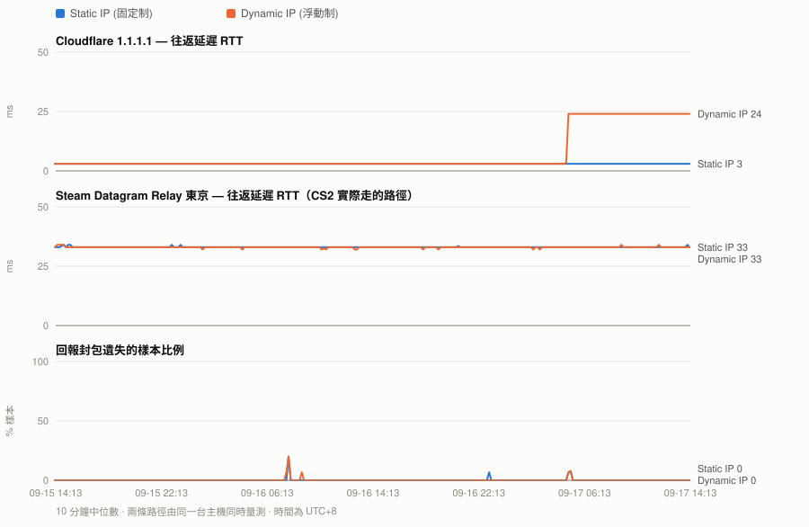
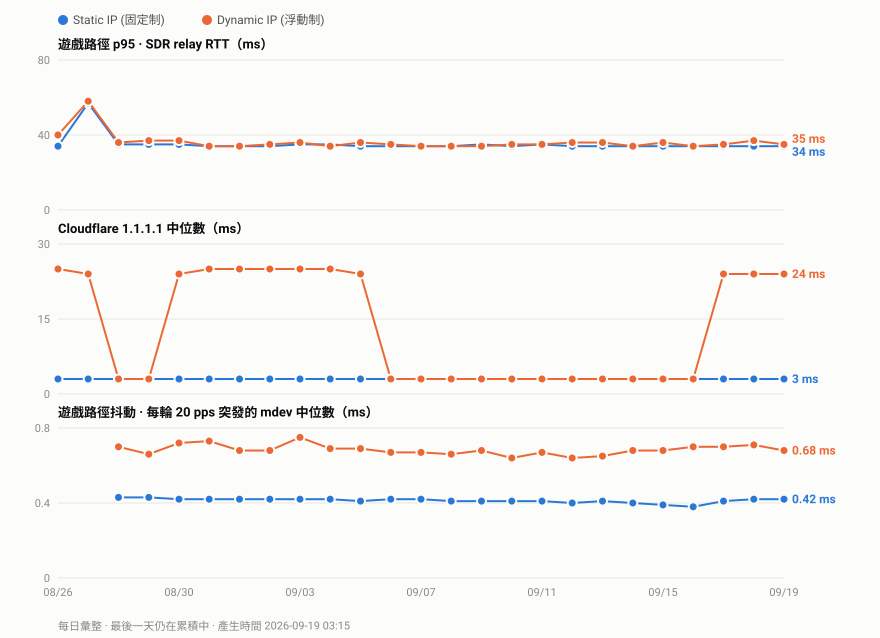

# CHT Static vs. Dynamic IP Ping Comparison for CS2

**English** · [繁體中文](README.md)

A live, concurrent A/B of two ISP account types on the same line, measured from one
Raspberry Pi — including a way to measure the **actual UDP path a Source 2 game (CS2, in this case) uses**,
not just ICMP to something nearby.

Short answer for the impatient: **for the game path, no. For everything behind
Cloudflare, dramatically yes.** The data below is regenerated hourly from a probe that
is still running.

<picture>
  <source media="(prefers-color-scheme: dark)" srcset="data/chart-dark.svg">
  
</picture>

Full numbers, always current: **[data/stats.md](data/stats.md)** · raw samples:
[data/paired-scrubbed.csv](data/paired-scrubbed.csv)

### Day to day

The chart above is a rolling 48-hour window, so a quiet day looks identical to the one
before it. This one is a **daily rollup** -- one point per day, growing for as long as the
probe keeps running:

<picture>
  <source media="(prefers-color-scheme: dark)" srcset="data/history-dark.svg">
  
</picture>

Per-day numbers: **[data/history.csv](data/history.csv)** -- one row per day, so the commit
diff is readable on its own. The last day is still accumulating and its values move.

---

## Why this exists

CS2 was spiking to 200 ms on an otherwise idle connection. The obvious suspects —
server picker, DNS, Wi-Fi — were all wrong. Traceroute eventually showed ICMP
`type 11 time-exceeded` from a routing loop between the ISP (HiNet, AS3462) and
Cloudflare (AS13335), with traffic detouring internationally instead of peering locally.

The ISP offers a free switch from a dynamic-IP account to a static-IP one. The obvious
question — *does that actually change the route?* — turns out to be surprisingly hard to
answer honestly, and most of the advice online is people comparing a speed test today
against their memory of last week.

## What makes this measurement different

**Two problems with the naive A/B, and how each is fixed.**

### 1. Sequential comparison is worthless

Switch the account type, re-run the test, compare. This measures *when you tested*, not
*what you changed* — transient ISP faults clear on their own and get credited to
whatever you did last. An earlier version of this experiment produced a confident
conclusion this way. It was wrong, and the next day's data contradicted it.

The fix: a single host holds **both account types up at once**. The primary path is the
router's normal connection; the second is a PPPoE session dialled by the Pi itself with
`nodefaultroute`, kept off the default route and reachable only through a policy-routing
rule. Every loop iteration measures both **concurrently**, so whatever transient hits the
line hits both paths at once and cancels out of the comparison.

> **Correction, and a warning if you copy this.** The first version of `probe.sh` measured
> the two paths one after the other — 8.6 s and 10.4 s respectively — while stamping both
> rows with the loop-start time. The CSV *looked* simultaneous and was about 9 s apart.
> Samples before `2026-08-27 21:02` carry that offset. It is far too small to explain the
> Cloudflare result (a 20× difference sustained for hours) but it was an overstatement,
> and a shared timestamp column is a very easy way to fool yourself.

```sh
# /etc/ppp/peers/<name>
nodefaultroute          # the measurement session must never become the system default

# /etc/ppp/ip-up.d/50measure   ($1=iface $4=local IP $6=ipparam)
[ "$6" = "measure" ] || exit 0
ip route replace default dev "$1" table 200      # <- without this the rule does nothing
ip rule del priority 200 2>/dev/null
ip rule add from "$4" lookup 200 priority 200
```

Both halves are needed: the `ip rule` sends traffic *sourced from* the second session to
table 200, and the `ip route` is what gives table 200 somewhere to send it. With only the
rule, lookups fall through to the main table and you silently measure the same path twice —
which is exactly the failure that made the first attempt at this experiment worthless.

The Pi is not a router and does not carry household traffic. It only holds a second
session so the two paths can be compared fairly.

### 2. ICMP to 1.1.1.1 is not the path your game uses

Games on Valve's Steam Datagram Relay send **UDP to a relay**, not ICMP to a DNS
resolver. Those can take different physical links — ECMP hashes on the 5-tuple, so even
two UDP flows can diverge. Pinging Cloudflare tells you about the Cloudflare path and
nothing more.

**The useful trick:** an SDR relay replies to a junk UDP datagram on its game port.
Send 32 random bytes to a relay on `27015–27060` and it answers:

```
Invalid/unknown MsgID 0
```

That is a full round trip on the exact transport the game uses, from a plain socket, with
no game running and no client library. [`scripts/sdrping.py`](scripts/sdrping.py) does
this and prints `avg_rtt,loss`.

**Caveat that matters:** the RTT is trustworthy, the loss figure is not. The relay
silently ignores a fraction of junk datagrams — 16–33% no-reply at every send interval
tested (0.12 s, 0.35 s, 0.8 s) while RTT stayed flat at 33.2–33.5 ms. It is rate-limiting
nonsense traffic, which is entirely reasonable of it. **Use this for latency, never for
packet loss.**

Relay addresses come from Valve's own endpoint:

```
https://api.steampowered.com/ISteamApps/GetSDRConfig/v1/?appid=730
```

## What the data says

See [data/stats.md](data/stats.md) for live figures. The shape of the result:

| | Static IP | Dynamic IP |
|---|---|---|
| **Game path** (Tokyo SDR relay, UDP) | median ~34 ms | median ~34 ms — **paired delta ≈ 0 ms** |
| Game path p95 | flat, ≈ the median | wanders 38–52 ms |
| **Cloudflare 1.1.1.1** | 3 ms, unwavering | 24 ms baseline, **200 ms+ under evening load, with packet loss** |

So:

- **The static IP does not lower game ping.** The median difference on the actual game
  transport is zero. Anyone claiming a static IP "gives you better ping" is not measuring
  the game path.
- **It does remove jitter.** The static path's p95 equals its median hour after hour; the
  dynamic path's does not. For a twitch shooter that is worth more than a few ms of
  average.
- **The Cloudflare fault only exists on the dynamic path.** Whatever the routing problem
  is, the two account pools are not handled identically, and only one of them detours.

### What this does *not* show

- The relay→game-server leg is invisible here. Of ~82 ms observed in-game, the probe can
  only see ~33 ms of it. A clean probe during a bad game would point at that leg.
- One line, one ISP, one city. This is a method you can re-run, not a general claim about
  static IPs.
- Two nights of peak-hour data at the time of writing, one of which was lost to an
  unrelated hardware failure (see below). The Cloudflare result is unambiguous; treat the
  jitter result as directional.


## Why Valorant is unaffected by this

On the same line, on the same evening, Valorant was usually fine while CS2 was spiking.
That is not luck — the two companies hand traffic to the internet in fundamentally
different ways.

| | CS2 (Valve SDR) | Valorant (Riot) |
|---|---|---|
| Transport network | Steam Datagram Relay, reaching relays over public transit | **Riot Direct** (AS6507), Riot's own private backbone |
| Ingress in Taiwan | depends on relay choice and whatever BGP is doing | a PoP at **TPIX** (Taipei Internet Exchange), peering directly with local ISPs |
| Does gameplay traffic touch Cloudflare | possibly — that is the fault this project found | **No.** Cloudflare only appears at the web/auth layer |
| Server location | depends on the relay (this project measures Tokyo) | Hong Kong / Tokyo / Singapore, reached over Riot's own backbone |

The crux: **HiNet and Cloudflare have no good local interconnect**, so that traffic
detours internationally — while **Riot lands in Taipei at TPIX**, so packets leave HiNet
straight into Riot Direct and stay on Riot's own network to Hong Kong or Tokyo. One path
can hit the routing loop; the other never goes near it.

> **Scope, stated plainly**: this probe does **not** measure Valorant. The above explains
> why the fault mechanism structurally cannot reach it — it is not a measurement result.

Worth adding: Valorant *did* go visibly unstable once during this investigation. The cause
turned out to be **Steam downloading a game in the background and saturating the uplink** —
nothing to do with routing. Stopping the download fixed it. **The same symptom in the same
game can have completely different causes. Measure first.**

## Repo layout

| Path | What it is |
|---|---|
| `scripts/probe.sh` | the sampling loop: both paths, every ~45 s, one CSV row each |
| `scripts/sdrping.py` | UDP RTT against a Steam Datagram Relay — the interesting bit |
| `scripts/hoptrace.sh` | hop-by-hop trace via plain `ping -t`, for when `mtr` is broken |
| `scripts/udptrace.py` | UDP traceroute matching returned ICMP by source port |
| `tools/gen_report.py` | CSV → charts + stats, stdlib only, runs on the Pi |
| `tools/publish.sh` | regenerate and push, on a timer |
| `cf-heartbeat/` | a Cloudflare Worker dead-man switch for the probe host |
| `systemd/` | the actual unit files, udev rules and PPPoE hooks, with install paths |

`mtr` is unusable on this box in both ICMP and UDP modes (hop 1, then `???` forever),
hence the hand-rolled tracers. If yours works, use it.

## The hardware detour

Halfway through, the probe host started crashing whenever the desk was bumped. Root
lived on a USB SSD, so a momentary contact glitch killed the whole OS — and took 13
hours of peak-hour data with it, which is the gap you can see in the chart.

The fix, and the three bugs found while proving it works, now live in their own
repository: **[rpi4-usb-ssd-resilience](https://github.com/Hydr0neFN/rpi4-usb-ssd-resilience)**. Short version: root moved to the SD card,
the SSD became a `nofail` mount, and a recovery ladder brings it back in 22 seconds
without human hands. Relevant to anyone running a Pi on a USB SSD with a Realtek RTL9210
bridge, which is a lot of people.

## Reproducing this

1. Get relay addresses for your region from `GetSDRConfig` above.
2. Point `scripts/sdrping.py` at one and confirm you get `Invalid/unknown MsgID 0` back.
3. If your ISP offers a second account type, dial it with `nodefaultroute` + a policy
   route so it never touches your default path.
4. Run `scripts/probe.sh` under systemd and leave it alone for several days, **including
   evenings** — off-peak data will tell you nothing.

The whole thing is a few hundred lines of shell and stdlib Python on hardware that was
already running.

## Licence

MIT. See [LICENSE](LICENSE).
